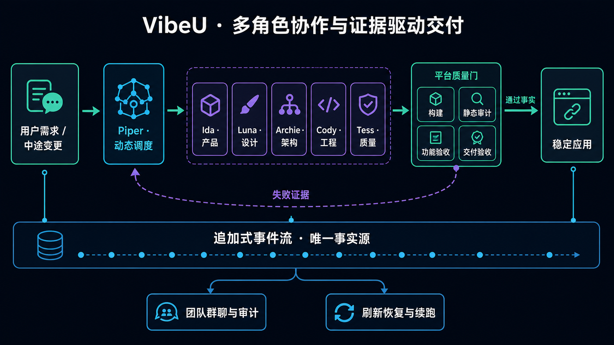

# VibeU

> 从一句需求，到一个能用的产品。

VibeU 是一个由多角色 AI 团队驱动的应用生成平台。用户描述想解决的问题后，产品、设计、架构、工程和质量角色会围绕同一份项目状态协作，产出可运行、可交互、可持久化的 Web 应用。

它的核心不是让模型“写完后说自己完成了”，而是把生成结果交给平台执行构建、静态审计、功能验收和交付采证。只有客观证据齐备，运行才会被标记为成功，生成应用才具备公开交付条件。

- 在线体验：[vibe-u-app.vercel.app](https://vibe-u-app.vercel.app/)
- 已完成示例：[待办清单完整工作流](https://vibe-u-app.vercel.app/workspace?run=20aJ9iXCfjABoT_8)
- 生成应用：[单独打开待办清单](https://vibe-u-app.vercel.app/a/20aJ9iXCfjABoT_8)
- 项目文档：[架构设计](docs/architecture.md) · [开发与验证](docs/development.md) · [UI 评审与版本演进](docs/versioning-and-design-review.md)

## 六个角色

| 角色 | 职责 | 主要产物 |
| --- | --- | --- |
| **Piper · 项目经理** | 判断下一步由谁处理，管理收敛与预算 | 派单决策、原因、任务简报 |
| **Ida · 产品负责人** | 定义做什么、优先级和交付边界 | PRD、验收标准、交付结论 |
| **Luna · 产品设计师** | 定义给谁用、如何呈现和操作 | 页面构图、视觉语言、交互约束 |
| **Archie · 系统架构师** | 设计数据关系与页面结构 | collection 模型、页面与状态设计 |
| **Cody · 全栈工程师** | 实现功能并修复构建或验收问题 | React 源码、样式、修复补丁 |
| **Tess · 质量工程师** | 把 PRD 转换成可执行验收用例 | 测试计划、失败证据、回归结果 |

产品负责人和项目经理被刻意拆开：Ida 决定“做什么、能否交付”，Piper 决定“现在该由谁处理”。质量工程师只报告测试事实，不自行修改需求或决定责任归属。

## 快速了解

一次典型生成会经历以下过程：

1. 用户用一句话描述目标用户、核心问题和必要功能。
2. Piper 根据当前事实决定下一步由谁处理，而不是执行写死的工作流。
3. Ida 整理产品范围和验收标准；用户可按需开启需求审核。
4. Luna 定义页面构图、视觉语言和关键交互。
5. Archie 设计数据模型与页面结构；简单需求也可以由 Piper 判断减少不必要环节。
6. Cody 编写 React 应用，并使用平台提供的数据接口实现持久化。
7. 平台真实构建代码、执行静态审计；失败证据返回团队重新处理。
8. Tess 编写并执行功能验收用例，Ida 根据客观采证完成最终交付验收。
9. 完整验收通过后，生成应用可通过独立公开链接打开和分享；候选构建与公开构建分开保存。

默认路径接近真实产品团队的协作顺序，但需求变更、测试失败和返工不依赖固定分支。每一轮由 Piper 依据最新产物、失败证据和剩余预算重新派单。

## 系统结构

编排、质量门、预算、事件流、稳定发布与数据服务的实现细节见 [架构设计](docs/architecture.md)。

## 与 Atoms 挑战的对应关系

VibeU 独立实现了题目要求的“由智能体驱动完成应用生成，并以可视化网页展示结果”：用户可以提交需求、观察多角色协作、查看设计与代码、操作生成应用，并在刷新或重新打开后继续使用持久化数据。

在基本生成流程之外，本项目重点扩展了三类能力：动态角色调度、平台侧证据质量门，以及可恢复、可审计的事件流。实现不依赖 Atoms 的内部代码或服务。

## 实现状态与演进方向

当前版本已经完成多角色协作、质量验证、公开访问和候选/公开双槽存储。验收后自动晋升公开版本的端到端闭环仍在补齐，正式产品将沿三条主线继续演进：

| 方向 | 当前已经实现 | 未来正式产品 |
| --- | --- | --- |
| **应用交付** | 提供公开链接；未验收候选不会被公开路由读取，成功运行在首次公开访问时完成懒晋升，运行时暂由 VibeU 承载 | 补齐验收后自动晋升闭环，并支持独立部署、单独域名、运行环境、数据源和发布周期 |
| **视觉设计** | Luna 输出结构化视觉方案；平台采集色板、DOM 和可访问性证据 | 接入 Figma 等设计工具，增加编码前 UI 评审和设计版本 |
| **专业角色** | 六个角色拥有独立职责和产物契约，由 Piper 调度、平台判定质量 | 演进为独立 subagent，为每个角色配置专用模型、上下文和工具 |

### 为什么先这样实现

角色契约、平台质量门和事件流已经相互解耦，因此未来替换模型、接入专业工具或拆分 subagent，都不需要重写核心流程。

当前边界：

- 暂无最终用户登录和多租户体系；
- 功能验收基于 jsdom，暂不覆盖像素级布局与视觉回归；
- 暂无正式快照和版本分支，规划见 [UI 评审与版本演进](docs/versioning-and-design-review.md)。

## 核心设计

> **Agent 可以提出“完成”，但只有平台证据能够确认“完成”。**

- **证据驱动交付**：构建、审计、功能验收与交付采证由平台执行；能运行不等于需求已完成。
- **动态调度**：Piper 根据最新产物、失败证据和预算决定下一角色，并通过轮次与重复失败限制保证收敛。
- **全程可观测**：决策、产物、用量、重试和质量结果进入同一事件流，统一支撑审计、刷新恢复与服务端续跑。
- **稳定可用**：公开路由与候选预览读取不同 bundle；生成应用支持真实持久化，测试数据与交付数据相互隔离。

具体实现见 [架构设计](docs/architecture.md)。
